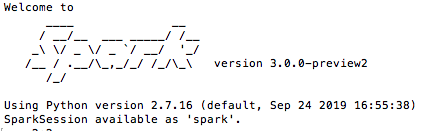

# Installing Spark on Mac OS

Installing Spark on Mac OS to practice in local mode.

***Prerequisite:*** you need to have a JDK installed. If you haven't a JDK go to https://www.oracle.com/java/technologies/javase-downloads.html

***Note:*** we'll install Spark on local mode, which is good for practicing but if you want to take advantage of the full power of Spark consider other types of installation, such as Amazon EMR

## Install Spark local mode

First you need to download a recent precompiled releaded version here http://spark.apache.org/downloads.html

Once you have installed it you can unpack as follow: 

```
tar -xf spark-3.0.0-preview2-bin-hadoop2.7.tgz
```
x flag is for extracting files and f flag specifies the tarball.

To check if we've succeded, we can launch pyspark terminal

```
cd spark-3.0.0-preview2-bin-hadoop2.7
bin/pyspark
```
If the operation is successful you will see a message like this


